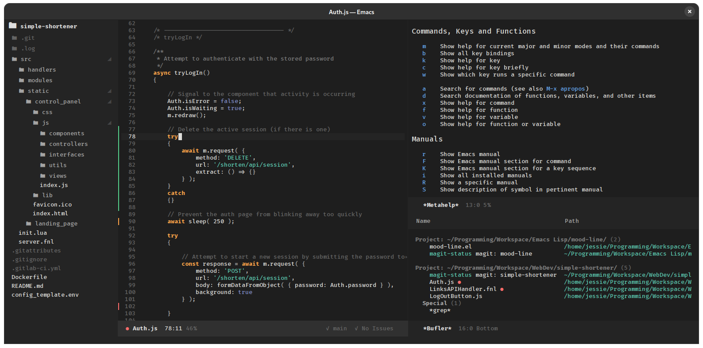

#  adwaita-dark-theme

A dark color scheme that aims to replicate the appearance and colors of GTK4 "libadwaita" applications.

## Features

* Beautiful dark color scheme inspired by Adwaita

* Automatic 256-color mode support

* Configurable theme features

* Custom configurations for
[neotree](https://github.com/jaypei/emacs-neotree)
and [eldoc-frame](https://git.tty.dog/jessieh/eldoc-frame)

* Custom fringe bitmaps for
[diff-hl](https://github.com/dgutov/diff-hl),
[flycheck](https://www.flycheck.org),
and [flymake](https://www.emacswiki.org/emacs/FlyMake)

* Lightweight, no dependencies

## Preview

## Configuration

To see all of the theme features that can be configured:

`M-x customize-group adwaita-dark-theme`

### Neotree Configuration

`(eval-after-load 'neotree #'adwaita-dark-theme-neotree-configuration-enable)`

### eldoc-frame Configuration

`(eval-after-load 'eldoc-frame #'adwaita-dark-theme-eldoc-frame-configuration-enable)`

### Fringe Bitmaps

To replace default line continuation/line wrap fringe bitmaps:\
`(adwaita-dark-theme-arrow-fringe-bmp-enable)`

For specific packages:

* diff-hl:\
`(eval-after-load 'diff-hl #'adwaita-dark-theme-diff-hl-fringe-bmp-enable)`

* flycheck:\
`(eval-after-load 'flycheck #'adwaita-dark-theme-flycheck-fringe-bmp-enable)`

* flymake:\
`(eval-after-load 'flymake #'adwaita-dark-theme-flymake-fringe-bmp-enable)`

## Feedback

If you experience any issues with this package, please
[open an issue](https://git.tty.dog/jessieh/adwaita-dark-theme/issues/new)
on the issue tracker.

Suggestions for improvements and feature requests are always appreciated, as well!
